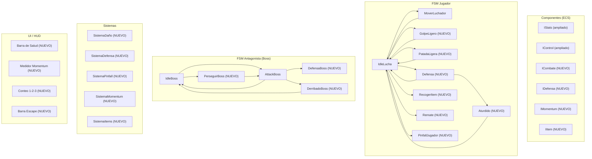

# Plan de Implementación: Juego de Lucha Libre — CimaEngine3v

## Resumen de Arquitectura Existente

Antes de detallar el plan, este es el inventario de lo que **ya existe** y se reutilizará:

| Concepto | Implementación Actual | Se Reutiliza |
|---|---|---|
| Entidad base | `Entidad` → hereda de `CE::Objeto` con ECS | ✅ |
| Stats (HP, STR, DEF, AGI) | `CE::IStats` (uint8_t por stat) | ✅ (ampliar) |
| FSM Jugador | `FSM` base → `IdleLucha`, `MoverLuchador` | ✅ (extender) |
| FSM Boss | `FSMBoss` → `IdleBoss`, `AttackBoss` | ✅ (extender) |
| Control de Inputs | `CE::IControl` (arr, abj, izq, der, acc, sacc, jmp, run) | ✅ (mapear nuevos) |
| Colisiones AABB | `SistemaColAABBMid` | ✅ |
| Movimiento | `SistemaMover2` | ✅ |
| Escena Match | `EscenaMatch` con tilemap ring + cuerdas | ✅ (extender) |
| Target / Aggro | `ITarget`, `IRangoAggro` | ✅ |
| Sprites animados | Spritesheet por renglón (Idle=row0, Walk=row1, Attack=row3) | ✅ |

---

## Diagrama General del Sistema



---

## Fase 1: Componentes de Combate

**Objetivo:** Crear los componentes de datos necesarios para el sistema de combate.

### 1.1 Ampliar `IStats`

> [!NOTE]
> `IStats` ya existe en `Motor/Componentes/IComponentes.hpp` con `hp`, `hp_max`, `str`, `def`, `agi`. Se debe considerar ampliar o crear un componente hijo.

**Archivo:** `src/Juego/Componentes/IJComponentes.hpp` + `.cpp`

Crear `ILuchadorStats` que extienda la información:

```cpp
class ILuchadorStats : public CE::IComponentes {
public:
    explicit ILuchadorStats(int vel, int fuerza, int resistencia);
public:
    int velocidad;    // 1-10
    int fuerza;       // 1-10  
    int resistencia;  // 1-10
};
```

**Protagonista:** vel=9, fuerza=6, resistencia=7  
**Antagonista:** vel=8, fuerza=6, resistencia=6

### 1.2 Componente `ICombate`

**Archivo:** `src/Juego/Componentes/IJComponentes.hpp` + `.cpp`

```cpp
class ICombate : public CE::IComponentes {
public:
    ICombate();
public:
    bool esta_atacando{false};     // flag: está en animación de ataque
    bool esta_derribado{false};    // flag: está en el suelo
    bool esta_aturdido{false};     // flag: defensa rota
    float cooldown_ataque{0.f};    // tiempo entre ataques
    float tiempo_derribo{0.f};     // cuánto tiempo lleva derribado
    float tiempo_aturdido{0.f};    // cuánto tiempo lleva aturdido
    int tipo_ataque{0};            // 0=ninguno, 1=golpe, 2=patada, 3=item, 4=remate
};
```

### 1.3 Componente `IDefensa`

```cpp
class IDefensa : public CE::IComponentes {
public:
    IDefensa();
public:
    bool defendiendo{false};
    int golpes_bloqueados{0};     // al llegar a 3, se rompe
    static const int MAX_BLOQUEOS = 3;
    float tiempo_rotura{2.f};     // segundos aturdido tras rotura
};
```

### 1.4 Componente `IMomentum`

```cpp
class IMomentum : public CE::IComponentes {
public:
    IMomentum();
public:
    float valor{0.f};             // 0.0 a 100.0
    static constexpr float MAX_MOMENTUM = 100.f;
    bool remate_disponible{false}; // se activa cuando valor >= MAX
};
```

### 1.5 Componente `IItem`

```cpp
class IItem : public CE::IComponentes {
public:
    enum TipoItem { SILLA = 0 };
    IItem(TipoItem tipo);
public:
    TipoItem tipo;
    float danio_extra{40.f};  // daño adicional por uso
    bool recogido{false};
};
```

---

## Fase 2: FSM del Jugador (Nodos Nuevos)

**Objetivo:** Crear los estados de animación y lógica del jugador.

**Directorio:** `src/Juego/Maquinas/lucha/`

> [!IMPORTANT]
> Todos los nodos heredan de `FSM` (la base del jugador). El patrón de animación existente es: cada renglón del spritesheet es un estado, con N frames horizontales.

### Asignación de renglones del spritesheet (`ShawnM.png` = 560×968, frame=80×88):

| Renglón | Estado | Frames |
|---------|--------|--------|
| 0 | Idle | 2 |
| 1 | Caminar | 3 |
| 2 | Golpe Ligero | 3 |
| 3 | Patada Ligera | 3 |
| 4 | Defensa (Guard) | 1 |
| 5 | Aturdido | 2 |
| 6 | Derribado | 2 |
| 7 | Remate (Finisher) | 4 |
| 8 | Recoger Item | 2 |
| 9 | Ataque con Item | 3 |
| 10 | Pinfall (cubriendo) | 2 |

> [!WARNING]
> Estos renglones son una propuesta. Debes verificar cuántos renglones tiene realmente tu spritesheet `ShawnM.png` (560×968 ÷ 88 alto = ~11 renglones). Si no tienes suficientes renglones, deberás expandir tu spritesheet o reutilizar renglones.

### 2.1 Archivos a crear

| Archivo | Clase | Descripción |
|---------|-------|-------------|
| `GolpeLigero.hpp/cpp` | `GolpeLigero : FSM` | Z → Animación row2, 3 frames. Al terminar → `IdleLucha` |
| `PatadaLigera.hpp/cpp` | `PatadaLigera : FSM` | Y → Animación row3, 3 frames. Al terminar → `IdleLucha` |
| `DefensaLucha.hpp/cpp` | `DefensaLucha : FSM` | C → Mantener row4. Si recibe 3 golpes → `AturdidoLucha` |
| `AturdidoLucha.hpp/cpp` | `AturdidoLucha : FSM` | Animación row5, 2s duración. Al terminar → `IdleLucha` |
| `DerribadoLucha.hpp/cpp` | `DerribadoLucha : FSM` | Jugador en el suelo. Escape con Spacebar. |
| `RemateLucha.hpp/cpp` | `RemateLucha : FSM` | F → Solo si momentum lleno. Animación row7. → `IdleLucha` |
| `RecogerItemLucha.hpp/cpp` | `RecogerItemLucha : FSM` | V → Cerca de item. Animación row8. → `IdleLucha` |
| `AtacarConItem.hpp/cpp` | `AtacarConItem : FSM` | Tras recoger. Animación row9. → `IdleLucha` |
| `PinfallLucha.hpp/cpp` | `PinfallLucha : FSM` | Cubrir oponente derribado. Conteo 1-2-3. |

### 2.2 Transiciones desde `IdleLucha::onInputs`

Modificar [IdleLucha.cpp](file:///c:/Users/DELL/Documents/IV/CimaEngine3v/src/Juego/Maquinas/lucha/IdleLucha.cpp):

```cpp
FSM* IdleLucha::onInputs(const CE::IControl& control)
{
    // Movimiento (existente)
    if(control.arr || control.abj || control.der || control.izq)
        return new MoverLuchador(3, 0.1f);
    
    // Golpe ligero (Z → acc)
    if(control.acc)  
        return new GolpeLigero(3, 0.08f);
    
    // Patada ligera (Y → sacc)
    if(control.sacc) 
        return new PatadaLigera(3, 0.08f);
    
    // Defensa (C → jmp, remapeado)
    if(control.jmp)  
        return new DefensaLucha();
    
    // Recoger (V → run, remapeado)
    // Solo si hay item cerca — verificar en el Sistema
    if(control.run)  
        return new RecogerItemLucha(2, 0.15f);
    
    // Remate (F) — necesita un bool extra en IControl o mapeo nuevo
    // Se manejará con extensión de IControl
    
    return nullptr;
}
```

### 2.3 Ampliación de `IControl`

**Archivo:** `src/Motor/Componentes/IComponentes.hpp`

Agregar campos a `IControl`:

```cpp
// Nuevos botones para lucha
bool punch{false};   // Z
bool kick{false};    // Y
bool guard{false};   // C
bool pickup{false};  // V
bool finisher{false};// F
```

### 2.4 Mecánica de doble-tap para correr

En `EscenaMatch::onInputs`, implementar un timer para detectar doble presión:

```cpp
// En EscenaMatch (miembros privados)
float tap_timer_der{0.f};
float tap_timer_izq{0.f};
int tap_count_der{0};
int tap_count_izq{0};
static constexpr float TAP_WINDOW = 0.3f; // 300ms para doble-tap
```

En `onUpdate`, decrementar los timers. En `onInputs`, si es "derecha" y `tap_count_der >= 2` dentro de la ventana → `control->run = true` y velocidad ×2.

---

## Fase 3: FSM del Antagonista (Nodos Nuevos)

**Objetivo:** Crear la IA del antagonista con estados de combate.

**Directorio:** `src/Juego/Maquinas/Bosses/`

> [!NOTE]
> Los nodos de Boss heredan de `FSMBoss`, que sobreescribe `onInputs(Entidad& parent, Vector2D& target)` usando la posición del jugador para tomar decisiones.

### 3.1 Archivos a crear

| Archivo | Clase | Descripción |
|---------|-------|-------------|
| `PerseguirBoss.hpp/cpp` | `PerseguirBoss : FSMBoss` | Caminar hacia el jugador si está en rango aggro pero fuera de rango ataque |
| `DefensaBoss.hpp/cpp` | `DefensaBoss : FSMBoss` | Probabilidad aleatoria de bloquear. Timer limitado. |
| `DerribadoBoss.hpp/cpp` | `DerribadoBoss : FSMBoss` | En el suelo. Probabilidad de escapar basada en HP. |

### 3.2 Lógica de IA del Antagonista

```
DIAGRAMA DE DECISIONES (cada frame):

IdleBoss:
  ├─ distancia > aggro_rango → quedarse Idle
  ├─ distancia < aggro_rango && > ataque_rango → PerseguirBoss
  └─ distancia < ataque_rango → AttackBoss (aleatorio: golpe/patada)

AttackBoss:
  ├─ animación terminada → IdleBoss (cooldown)
  └─ HP < 30% → 20% chance → DefensaBoss

PerseguirBoss:
  ├─ distancia < ataque_rango → AttackBoss
  └─ distancia > aggro_rango → IdleBoss

DerribadoBoss:
  ├─ probabilidad_escape(HP) → IdleBoss
  └─ conteo llega a 3 → DERROTA (fin del match)
```

### 3.3 Fórmula de escape del conteo (PC)

```
probabilidad_escape = (HP_actual / HP_max) * resistencia * 10
// Ejemplo: 60HP/100HP * 6 * 10 = 36% de escapar cada segundo
// A 20HP: 20/100 * 6 * 10 = 12% de escapar
```

---

## Fase 4: Sistemas de Combate

**Objetivo:** Crear funciones de Sistema (estilo ECS) que procesan la lógica frame a frame.

**Archivo:** `src/Juego/Sistemas/Sistemas.hpp` + `.cpp`

### 4.1 `SistemaDaño`

```cpp
void SistemaDaño(Entidad& atacante, Entidad& defensor);
```

**Lógica:**
1. Verificar que `atacante` tiene `ICombate` y está atacando.
2. Verificar colisión (AABB o rango corto).
3. Si `defensor` tiene `IDefensa` y `defendiendo == true`:
   - Incrementar `golpes_bloqueados`.
   - Si `golpes_bloqueados >= 3` → romper defensa, `esta_aturdido = true`.
   - Reducir daño al 10%.
4. Calcular daño:
   ```
   daño_base = { golpe: 5, patada: 8, item: 25, remate: 50 }
   daño_final = daño_base * (atacante.fuerza / 5.0) * (5.0 / defensor.resistencia)
   ```
5. Aplicar daño a `defensor.stats->hp`.
6. Si `HP <= 0` → `esta_derribado = true`.
7. Cargar momentum al atacante: `momentum += daño_final * 0.5`.

### 4.2 `SistemaDefensa`

```cpp
void SistemaDefensa(Entidad& ente, float dt);
```

- Si `esta_aturdido`, decrementar timer. Al terminar → resetear.
- Si `golpes_bloqueados >= MAX_BLOQUEOS` → activar aturdimiento.

### 4.3 `SistemaMomentum`

```cpp
void SistemaMomentum(Entidad& ente);
```

- Si `momentum >= 100` → `remate_disponible = true`.
- Clamping del valor a [0, 100].

### 4.4 `SistemaConteoPC` (Antagonista intenta escapar)

```cpp
bool SistemaConteoPC(Entidad& derribado, float dt, int& conteo);
```

- Cada segundo, tirar dado con probabilidad de escape basada en HP.
- Si no escapa → incrementar conteo.
- Si `conteo >= 3` → retornar true (victoria del jugador).

### 4.5 `SistemaConteoJugador` (Jugador intenta escapar con mash)

```cpp
bool SistemaConteoJugador(Entidad& jugador, float dt, int& conteo, float& barra_escape);
```

- `barra_escape` se incrementa con cada presión de Spacebar.
- Velocidad de llenado inversamente proporcional a HP perdido:
  ```
  velocidad = base_vel * (HP_actual / HP_max) * (resistencia / 5.0)
  ```
- Si `barra_escape >= 100` antes de que `conteo` llegue a 3 → escapa.

---

## Fase 5: Sistema de Items

**Objetivo:** Implementar la caída y recogida de sillas.

### 5.1 Spawner de Items

En `EscenaMatch::onUpdate`, usar un timer:

```cpp
float item_timer{0.f};
static constexpr float ITEM_INTERVAL = 30.f; // cada 30 segundos

// En onUpdate:
item_timer += dt;
if(item_timer >= ITEM_INTERVAL) {
    // Crear entidad silla en posición aleatoria del ring
    auto silla = std::make_shared<Entidad>();
    silla->addComponente(sprite_silla)
         .addComponente(std::make_shared<IItem>(IItem::SILLA))
         .addComponente(std::make_shared<CE::IBoundingBox>(CE::Vector2D{20,20}));
    silla->setPosicion(rand_x, rand_y);
    objetos.agregarPool(silla);
    item_timer = 0;
}
```

### 5.2 Recogida

En `SistemaMover2` o en un nuevo `SistemaItems`:

```cpp
void SistemaItems(Entidad& jugador, CE::Pool& objetos);
```

- Si jugador presiona V y hay colisión con un item → marcar como recogido, eliminar del pool, dar componente `IItem` al jugador.

---

## Fase 6: Mapeo de Controles en EscenaMatch

### 6.1 Registro de botones

Modificar [EscenaMatch::onInit](file:///c:/Users/DELL/Documents/IV/CimaEngine3v/src/Juego/Escenas/EscenaMatch.cpp#L27-L38):

```cpp
// Controles existentes (mantener)
registrarBotones(sf::Keyboard::Scancode::Left,  "izquierda");
registrarBotones(sf::Keyboard::Scancode::Right, "derecha");

// Controles de combate (nuevos/reasignar)
registrarBotones(sf::Keyboard::Scancode::Z, "punch");     // Golpe Ligero
registrarBotones(sf::Keyboard::Scancode::Y, "kick");       // Patada Ligera
registrarBotones(sf::Keyboard::Scancode::C, "guard");      // Defensa
registrarBotones(sf::Keyboard::Scancode::V, "pickup");     // Recoger
registrarBotones(sf::Keyboard::Scancode::F, "finisher");   // Remate
registrarBotones(sf::Keyboard::Scancode::Space, "escape"); // Barra de escape
```

### 6.2 Mapeo a `IControl`

En `EscenaMatch::onInputs`, mapear las acciones a los campos de `IControl`:

```cpp
if(accion.getNombre() == "punch")
    jugador_ref->getComponente<CE::IControl>()->punch = (tipo == OnPress);
if(accion.getNombre() == "kick")
    jugador_ref->getComponente<CE::IControl>()->kick = (tipo == OnPress);
// ... etc
```

---

## Fase 7: HUD / UI

**Objetivo:** Renderizar barras de salud, momentum y el conteo visualmente.

### 7.1 Renderizar en `EscenaMatch::onRender()`

Dibujar **después** de las cuerdas, en coordenadas de pantalla (no del mundo):

```cpp
// Cambiar a vista de UI
auto& ventana = CE::Render::Get().GetVentana();
sf::View ui_view = ventana.getDefaultView();
ventana.setView(ui_view);

// Barra HP Jugador (arriba izquierda)
dibujarBarraHP(jugador_ref, 20.f, 20.f, sf::Color::Green);

// Barra HP Antagonista (arriba derecha)
dibujarBarraHP(boss, ventana.getSize().x - 220.f, 20.f, sf::Color::Red);

// Medidor Momentum (abajo centro)
dibujarMomentum(jugador_ref, ventana.getSize().x/2 - 100.f, ventana.getSize().y - 40.f);

// Restaurar vista del juego
ventana.setView(CE::GestorCamaras::Get().getCamaraActiva().getView());
```

### 7.2 Funciones auxiliares de dibujo

```cpp
void dibujarBarraHP(const Entidad& ente, float x, float y, sf::Color color);
void dibujarMomentum(const Entidad& ente, float x, float y);
void dibujarConteo(int conteo, float x, float y);         // Muestra "1!", "2!", "3!"
void dibujarBarraEscape(float progreso, float x, float y); // Barra del mash
```

---

## Orden de Implementación Recomendado

```mermaid
gantt
    title Orden de Implementación
    dateFormat X
    axisFormat %s
    
    section Fase 1
    ILuchadorStats + ICombate + IDefensa + IMomentum : f1, 0, 2
    
    section Fase 2
    Ampliar IControl con nuevos botones : f2a, 2, 3
    GolpeLigero + PatadaLigera (FSM) : f2b, 3, 5
    DefensaLucha + AturdidoLucha : f2c, 5, 7
    RemateLucha + DerribadoLucha : f2d, 7, 9
    
    section Fase 3
    PerseguirBoss : f3a, 5, 7
    DefensaBoss + DerribadoBoss : f3b, 7, 9
    
    section Fase 4
    SistemaDaño : f4a, 9, 11
    SistemaDefensa + SistemaMomentum : f4b, 11, 13
    
    section Fase 5
    SistemaConteo (PC + Jugador) : f5, 13, 15
    
    section Fase 6
    Items (spawn + recogida) : f6, 15, 17
    
    section Fase 7
    HUD (barras HP + momentum + conteo) : f7, 13, 17
    
    section Integración
    Mapeo controles + doble-tap : fi, 2, 5
    Integración en EscenaMatch : fi2, 17, 19
```



---

## Archivos Nuevos a Crear (Resumen)

### Componentes
- `IJComponentes.hpp/cpp` — Agregar: `ILuchadorStats`, `ICombate`, `IDefensa`, `IMomentum`, `IItem`

### FSM Jugador (`src/Juego/Maquinas/lucha/`)
| Archivo | Estado |
|---------|--------|
| `GolpeLigero.hpp/cpp` | ⬜ |
| `PatadaLigera.hpp/cpp` | ⬜ |
| `DefensaLucha.hpp/cpp` | ⬜ |
| `AturdidoLucha.hpp/cpp` | ⬜ |
| `DerribadoLucha.hpp/cpp` | ⬜ |
| `RemateLucha.hpp/cpp` | ⬜ |
| `RecogerItemLucha.hpp/cpp` | ⬜ |
| `AtacarConItem.hpp/cpp` | ⬜ |
| `PinfallLucha.hpp/cpp` | ⬜ |

### FSM Antagonista (`src/Juego/Maquinas/Bosses/`)
| Archivo | Estado |
|---------|--------|
| `PerseguirBoss.hpp/cpp` | ⬜ |
| `DefensaBoss.hpp/cpp` | ⬜ |
| `DerribadoBoss.hpp/cpp` | ⬜ |

### Sistemas (`src/Juego/Sistemas/`)
- Agregar en `Sistemas.hpp/cpp`: `SistemaDaño`, `SistemaDefensa`, `SistemaMomentum`, `SistemaConteoPC`, `SistemaConteoJugador`, `SistemaItems`

### Archivos a Modificar
| Archivo | Cambio |
|---------|--------|
| `IComponentes.hpp` | Agregar campos a `IControl` |
| `IJComponentes.hpp/cpp` | Nuevos componentes |
| `IdleLucha.cpp` | Transiciones a nuevos estados |
| `IdleBoss.cpp` | Transiciones a PerseguirBoss |
| `EscenaMatch.hpp/cpp` | Controles, items, HUD, integración |
| `Sistemas.hpp/cpp` | Nuevos sistemas de combate |
| `CMakeLists.txt` (lucha + Bosses) | Registrar archivos nuevos |

---

> [!CAUTION]
> **Dependencia crítica:** Los spritesheets (`ShawnM.png` y `MrP.png`) deben tener los renglones necesarios para cada estado de animación. Si no los tienen, hay que expandirlos **antes** de implementar los nodos FSM. Verifica cuántos renglones tienen actualmente.
